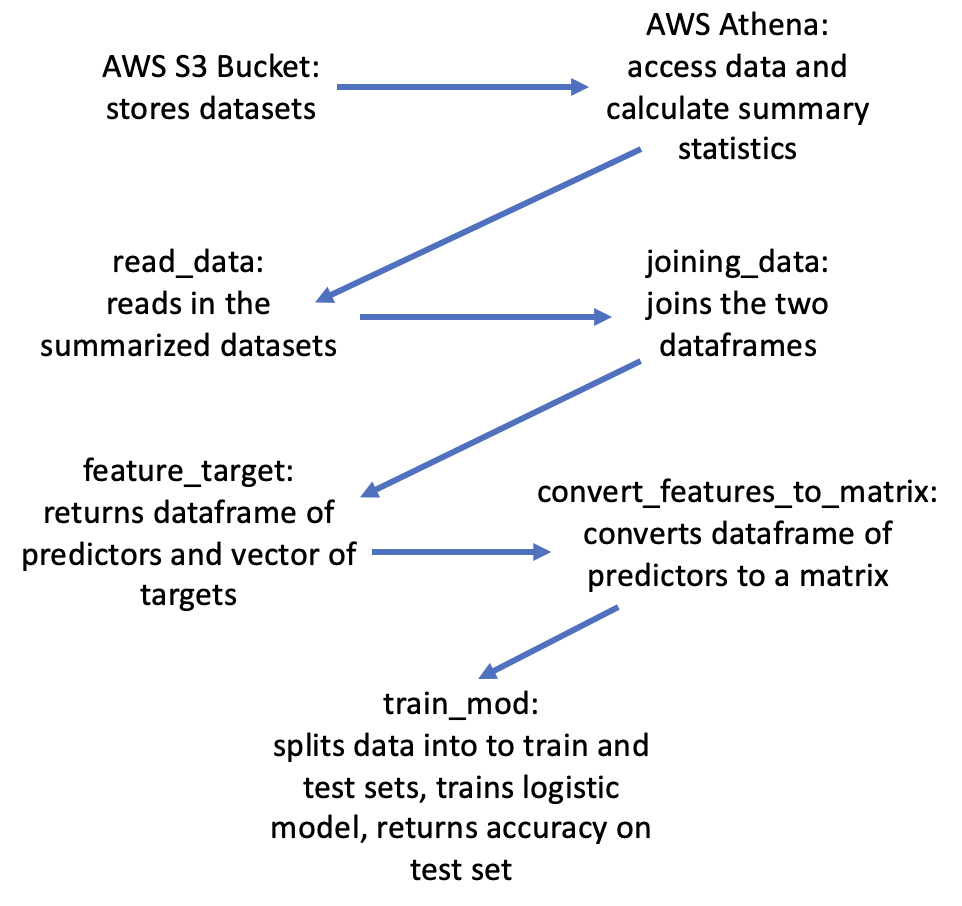
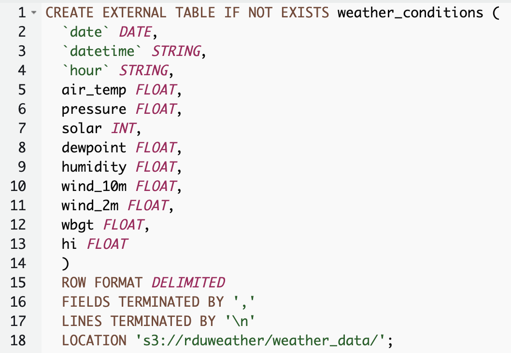
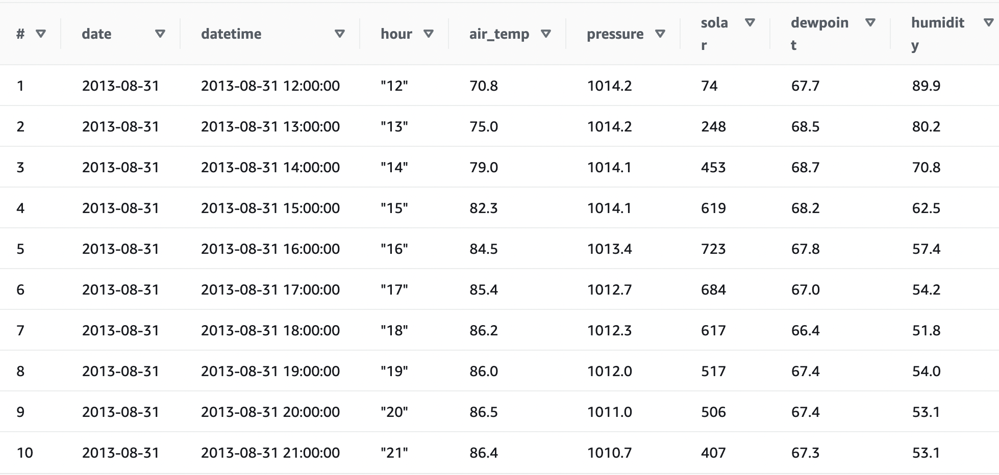
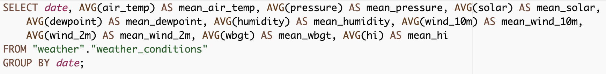
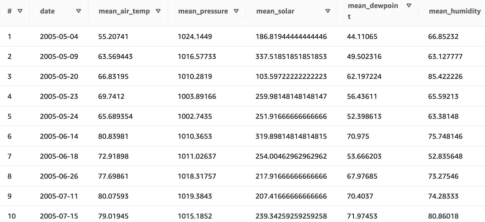

# Project 4 - Big Data
The goal of this project was to predict heat warnings in Durham County based on hourly weather conditions at Raleigh-Durham International Airport from May 2005 to September 2022. The heat alerts data was obtained from the National Weather Service Raleigh Weather Forecast Office and the weather conditions dataset was obtained from ERA5-Land. The weather variables are: air temperature (in degrees Farenheit), atmospheric pressure, solar radiation, dewpoint temperature (in degrees Farenheit), humidity (expressed as a percentage), two-meter and ten-meter wind speed, wet bulb globe temperature, and heat index. The heat alert data is a list of each day with any heat-related advisory issued for Durham County.

For this project, I used AWS S3 and Athena to store and summarize the data. Since the hourly weather conditions dataset was very large, I first uploaded the entire dataset to an S3 bucket. Then I created a new database in Athena and read the data into a table:
   

    
Once the main table was created, I used a series of SQL commands to calculate the daily minimum, maximum, mean, and variance for each variable: 
   

   
Then I output the summary data for each day as a csv to be used for analysis. The lib.rs file has six functions: read_data, print_rows, joining_data, feature_target, convert_target_to_matrix, and train_mod. The read_data function reads in the summary weather data and list of heat alerts into polars dataframes. The print_rows function prints the first five rows of the given dataframe so I could make sure the data was read in correctly. The joining_data function joins the summary weather dataframe and heat alerts dataframe, creating a binary column denoting if each day has a heat alert. The feature_target function removes unnecessary columns from the dataframe and extracts the target vector. The convert_target_to_matrix function converts the dataframe of predictors into a matrix that can be used with smartcore functions. The train_mod function takes in the feature matrix, target vector, size of the test set, and a random seed. It then splits the data into train and test sets, trains a logistic regression model, and outputs the accuracy on the test set. 
   
The tests directory holds the test to make sure the tool is running correctly. The entire algorithm takes 7.96 seconds to run.

## References

* [rust-cli-template](https://github.com/kbknapp/rust-cli-template)
* [smartcore-example](https://levelup.gitconnected.com/machine-learning-and-rust-part-3-smartcore-dataframe-and-linear-regression-10451fdc2e60)
